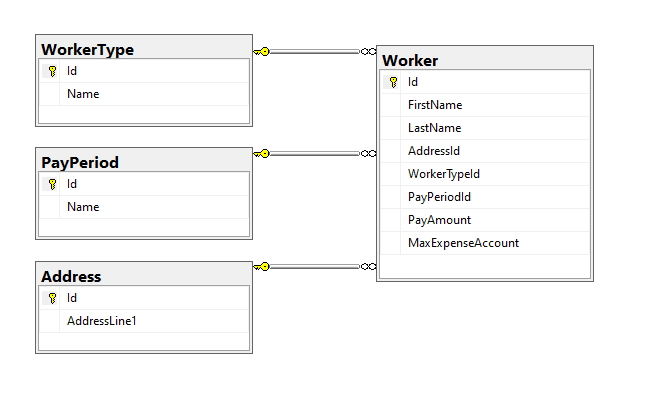

# ASH.WorkerManagement
Repository for code test on American Specialty Health interview

### CRUD Approach

To normalize the employees, supervisors and managers tables, a pattern called table-per-hierarchy (TPH) is used:

The reason why I picked TPH approach is that I plan to use Entity Framework Core as ORM in the project, and currently EF Core only supports TPH out of the box.

I could have created a simple CRUD application (Web API) that reads and write the exact same models as what the database has to complete this code test, but I won't be satisfied with that because this test is meant to test my skills on how to archtecture the projects and layers within the solution. 

Hence I am going to take a risk myself and try to demo how to build it using DDD approach.

### DDD Approach

Normally when you build any enterprise-level system, you would have to sit with a domain expert to see what's the domain problem this application is trying to solve. The problem statement of this test is definitely lack of that (hence this might not be good choice for DDD), but in general:

###### ASH.WorkerManagement.Domain
This is the core class library that contains core business objects and logic. I'm trying to model classes in business terms not developer's language.

###### ASH.WorkerManagement.Application.WebAPI
This is the application layer that controls the usecase of the application. The Web API project is part of it.

###### ASH.WorkerManagement.Infrastructure.Persistence.EFCore
This is the project that handles persistency. Since I end it with EFCore, this is an Entity Framework Core implementation that works with a relational database (MSSQL).

###### ASH.WorkerManagement.Domain.SharedKernel
This is just a common library for implementing DDD

### The flows in my mind

1. A client accesses the API to request a list of workers, or add a new worker. 
2. ASP.NET Core handles the requests and translates it into queries and commands.
3. For queries, i.e., getting a list of workers, the API will directly call DbContext and get necessary data from the database.
4. For commands, i.e., creating a new worker, client fires a POST request to the API. API takes client's data and passes them to a command handler. The command handler uses domain objects to create the needed instances, and persists them back to database by calling the repositories.

### Persistence

I am planning to use a different set of model than what I have on domain models for persistence, despite the fact that there will be lots of code to write. The domain model is meant to reflect the business problems, which should be persistence ignorance. That way when it's time to persist the models to the database, we will have the choice to design what models are the best to work with.

